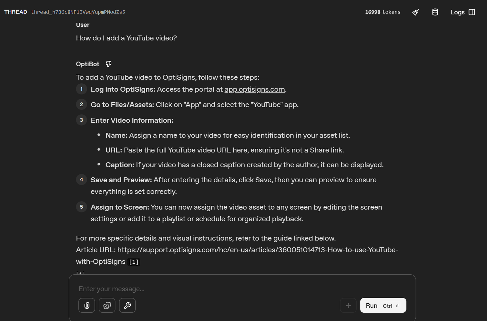

# ArtBot

Daily job that mirrors the OptiSigns help center into an OpenAI vector store,
plus an assistant ("OptiBot") that answers support questions from those docs
with citations.

## How it works

`main.py` runs once and exits:

1. Pulls every article from the Zendesk help center API (no HTML scraping,
   the API returns the article body directly).
2. Converts each body to markdown, writes it to `data/articles/<slug>.md`
   with YAML front matter (title, id, url, updated_at).
3. Diffs against what's already in the vector store and uploads only the
   delta. Prints `RESULT added=N updated=N skipped=N` at the end.

There is no database. Each uploaded file carries `{slug, hash}` attributes,
so listing the store gives the full remote state. The hash covers title, url
and converted body, but not `updated_at`, because Zendesk bumps that field
on edits that don't change the visible article.

Chunking is OpenAI's default (800 token chunks, 400 token overlap). The
articles are short and heavily sectioned, so the default splits them fine.
The catch I hit: retrieval often returns a middle chunk, and when the chunk
didn't contain the article's URL the bot would cite a plausible-looking URL
from its training data that 404s. So the uploaded variant of each doc
repeats its `Article URL:` line at the top, after every h2 and at the end,
which puts the real URL in every chunk. The live test fails if the bot ever
cites a URL that isn't in the scraped corpus.

## Setup

```
cp .env.sample .env      # put your OPENAI_API_KEY in it
uv sync
```

## Run locally

```
uv run python main.py                    # full sync
uv run python scripts/create_assistant.py  # one-off, creates the assistant
uv run pytest                            # offline unit tests
uv run pytest -m live                    # end-to-end test, costs a few cents
```

`ARTICLE_LIMIT=30 uv run python main.py` caps the sync for cheap test runs.

## Docker

```
docker build -t articlebots .
docker run --rm -e OPENAI_API_KEY=sk-... articlebots
```

The container runs one sync and exits 0.

## Daily job

Deployed as a Render cron job (`render.yaml`), daily at 03:00 UTC.
Job logs: https://dashboard.render.com/cron/crn-d948mdhkh4rs73enohjg/logs

The dashboard link needs a Render login, so here is what the latest run
printed:

```
2026-07-04 04:27:29,373 INFO fetched 404 articles
2026-07-04 04:27:43,028 INFO using vector store articlebots-kb (vs_6a48090d96d0819195d2125c8f0e28ba)
2026-07-04 04:28:07,725 INFO store has 404 tracked files
2026-07-04 04:28:08,106 INFO store now holds 404 files, 4782828 bytes indexed
RESULT added=0 updated=0 skipped=404
```

The store already held every article at that point, so the run skipped
all 404 of them. The first sync is the mirror image: added=404 updated=0
skipped=0, followed by a few minutes of server-side indexing.

## Screenshot



## Known limitations

- Articles deleted from the help center are not removed from the store.
  Next step would be detaching any remote slug that no longer exists locally.
- The OpenAI Assistants API is deprecated in favor of the Responses API.
  I kept it because the task asks for a Playground-testable assistant, and
  the sync code (files + vector stores) is unaffected either way.
